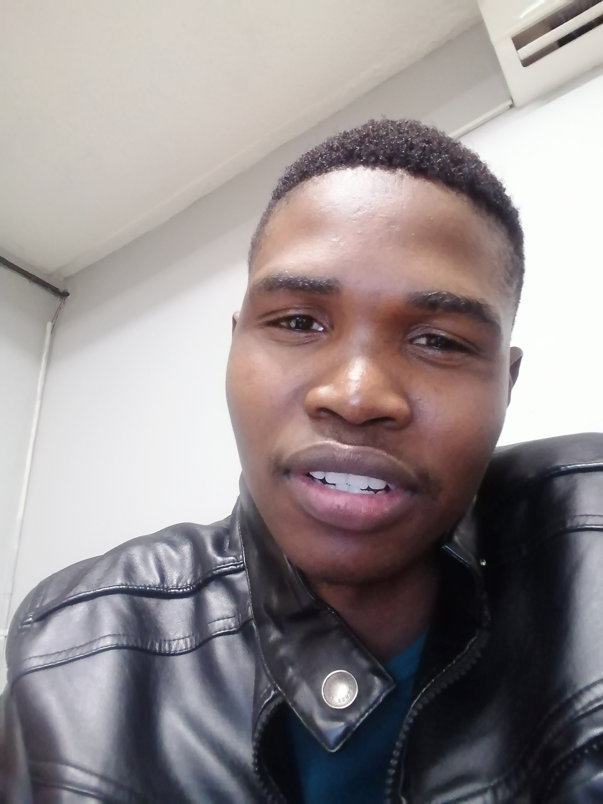

<!DOCTYPE HTML>
<!--
	Editorial by HTML5 UP
	html5up.net | @ajlkn
	Free for personal and commercial use under the CCA 3.0 license (html5up.net/license)
-->
<html>
	<head>
		<title>Dev profile </title>
		<meta charset="utf-8" />
		<meta name="viewport" content="width=device-width, initial-scale=1, user-scalable=no" />
		<link rel="stylesheet" href="assets/css/main.css" />
	</head>
	<body class="is-preload">

		<!-- Wrapper -->
			

				<!-- Main -->
					

						

							<!-- Header -->
								<header id="header">
									<a href="index.html" class="logo"><i>links to my socials</i> </a>
									<ul class="icons">
										<li><a href="https://www.linkedin.com/in/monametsi-s-050639130/" class="icon brands fa-linkedin">LinkedIn</a></li>										
										<li><a href="https://www.instagram.com/descientist_?igsh=MXZvaGlyYzZuMmY3ZA==" class="icon brands fa-instagram">Instagram</a></li>
										<li><a href="https://medium.com/@monametsiseele" class="icon brands fa-medium-m">Medium</a></li>
									</ul>
								</header>

							<!-- Banner -->
								<section id="banner">
									

										<header>
											<h1>Hi, I’m Monametsi Seele 
											a Software Engineer </h1>
											
I DESIGN WEB APPLICATIONS FOR A LIVING 

										</header>
										
Do you ever feel feel like your business does not have much visibility? Do you want to increase your customer base?
										   Whether you feel invisible or you want to have more customers. I can help you meet more customers even beyond the boundaries
										   of your imaginations. Let's connect so I can design a great website for you. Reputable companies have increased their customer base 
										   thrice as much after I designed websites for them don't be left behind.
								
										

										<ul class="actions">
											<li><a href="#foo" class="button big">Learn More</a></li>
										</ul>
									

									
										
									
								</section>

							<!-- Section -->
								<section>
									<header class="major">
										<h2>Interests</h2>
									</header>
									

										<article>
											
											

												<h3>Web Developer</h3>
												
I love to build websites for individuals, companies and small businesses

											

										</article>
										<article>
											
											

												<h3>Entrepreneuership</h3>
												
 Scientists came with ideas to describe the world, mathematicians came with numbers to unleash the wonders of the world, engineers used the ideas of scientists and mathematicians to create a better world but entrepreneurs 
													grouped a team of scientists, mathematicians and engineers to create value in the world. My mission is to create value in the world. 

											

										</article>
										<article>
											
											

												<h3>Public Speaking</h3>
												
I am a seasonal public speaker who has had their fair share in the exhilarating and nerve-wrecking experience of public speaking. Whether it's about personal experiences, my faith in God or tech and science I always show up to the occassion. I also take part in podcasts 

											

										</article>
										<article>
											
											

												<h3>Commando</h3>
												
Ever since my first experience in commando as a teenager I am addicted to the adrenaline, fear and excitement. Although commando comes with risks I find it to be worh it. Whether it's crawling in the mud, walking on logs, climbng on the nets and many more I fight to the end and my excitement triumphs over my fears

											

										</article>
									

								</section>

							<!-- Section -->
								<section>
									<header class="major" id = "foo">
										<h2>Get in touch</h2>
									</header>
									
For any inquiries contact me

									<ul class="contact">
										<li class="icon solid fa-envelope"><a href="#">seelemonametsi@gmail.com</a></li>
										<li class="icon solid fa-phone">(+267) 75582320</li>
										<li class="icon solid fa-home">South East, Botswana
										</li>
									</ul>
								</section>

							<!-- Footer -->

								<footer id="footer">
									
&copy; All rights reserved 2024. 

								</footer>

						

					

			

		<!-- Scripts -->
			
			
			
			
			

	</body>
</html>
